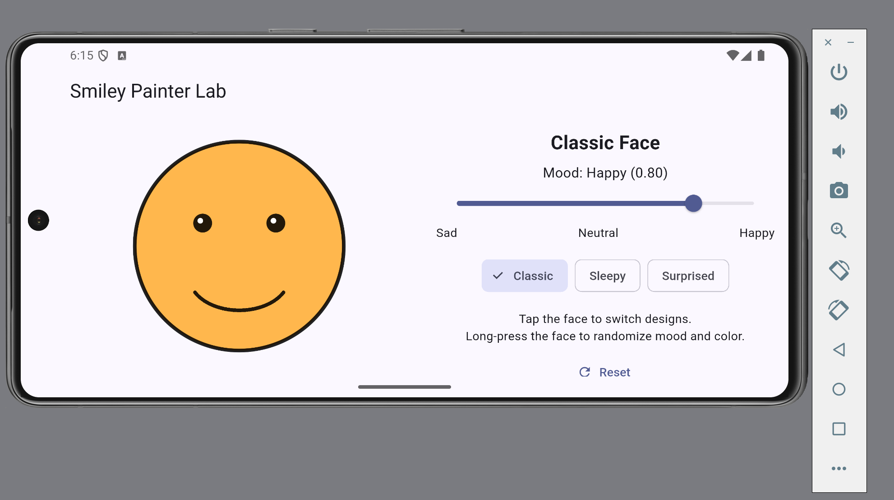

# Critical Thinking - Drawing with Flutter
Student: Jihun Kim

I calculated the face radius using size.shortestSide * 0.4 so the face fits within the drawing area. The mouth is centered horizontally, placed 0.3 * radius below the face center, and has a width of 0.95 * radius. I used drawArc with a sweep angle of 0.70 * pi and changed the starting angle and mouth height to show different moods. I tested portrait and landscape layouts on the Android emulator, and placing the controls beside the face in landscape kept the layout responsive without overflow. My shouldRepaint method returns true when the mood, face color, or face type changes, and false when all three inputs stay the same.

## Emulator Screenshot

